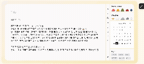
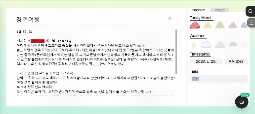

---

# 🧅 Onion : AI Emotion Pattern Analysis Diary

> **"당신의 무의식 속에 숨겨진 심리 패턴을 데이터로 정밀 분석합니다."**
> Gemini API를 활용하여 정제되지 않은 진실을 추출하고, 사용자의 심리적 성장을 돕는 지능형 리포팅 서비스입니다.

🔗 **[서비스 바로가기](https://onion-project-fe.vercel.app/)**

---

## 🚀 프로젝트 개요

* **Gemini 3 Hackathon 참여 프로젝트**
* **개발 목표**: 단순 기록을 넘어 사용자의 '자극-반응' 메커니즘을 추출하는 심리 패턴 라이브러리 구축
* **핵심 가치**: 익명성을 통한 데이터 무결성 확보 및 시계열적 성격 변화 추적
* **AI Engine**: Google Gemini 3 API

---

## ✨ 주요 기능

### 1. 멀티모달 일기 기록 시스템

* **텍스트 및 이미지 기반 기록**: 사용자가 작성한 텍스트와 사진 데이터를 통해 일상을 입체적으로 기록합니다.

### 2. 일일 감정 분석 및 맞춤형 솔루션

* **개별 일기 분석**: 매일 작성된 일기에서 작성자의 세밀한 감정 상태를 파악하고 심층 분석합니다.
* **AI 솔루션**: 분석된 심리 상태에 따라 정서적 조언과 맞춤형 해결 방안을 실시간 제공합니다.

### 3. 대화형 AI 챗봇 연동

* **심층 Q&A**: 분석 내용을 바탕으로 AI 챗봇과 대화하며 본인의 내면을 더 깊이 탐색할 수 있습니다.

### 4. 격주 단위 심리 종합 리포트 (Bi-weekly Report)

* **데이터 종합 분석**: 한 달에 2번, 누적된 데이터를 통합 분석하여 심리 상태의 변화 추이를 리포팅합니다.

### 5. 시각화된 감정 나무 형상화 시스템

* **상태 시각화**: 분석 결과에 따라 캐릭터(양파/나무)가 변화하며 사용자의 심리적 성장을 직관적으로 보여줍니다.

---

## 📸 서비스 데모 (Demo)

| 1. 일기 작성 및 멀티모달 기록 | 2. 일일 감정 분석 및 솔루션 |
| :---: | :---: |
|  |  |
| **3. AI 챗봇 심층 대화** | **4. 심리 리포트 및 감정 나무** |
|  |  |

## 🧠 Solution & Value 

### ✅ 익명성을 통한 데이터 무결성(Data Integrity) 확보

* **방어 기제 해제**: 사람이 아닌 AI 분석을 통해 사용자의 심리적 방어 기제를 낮춥니다.
* **고순도 데이터화**: 기존 대면 검사보다 **순도 높은 '정제되지 않은 진실'**을 데이터화하여 분석 신뢰도를 높였습니다.

### ✅ 단순 기록에서 '패턴 라이브러리'로의 진화

* **자극-반응 메커니즘 추출**: 특정 상황(자극)에 대한 사용자의 심리 패턴을 추출하여 고유한 '심리 반응 지도'를 형성합니다.

### ✅ 성향 기반의 객관적 대응 방안 제시

* **반복 갈등 분석**: 반복되는 갈등 상황에서의 대응 방식을 객관화하고, 개인 성향에 최적화된 개선 방안을 제안합니다.

### ✅ Personality 업데이트 및 시계열 비교

* **동적 페르소나 반영**: 최신 일기 데이터를 기반으로 변화하는 성격(Personality)을 업데이트하며 과거의 나와 현재를 정밀 비교합니다.

---

## 🛠 기술 스택

* **Frontend**: React, Vite, Tailwind CSS
* **Backend**: Node.js, MongoDB, FastAPI, JWT, Bcrypt, Pydantic, Render
* **AI API**: Google Gemini 3 API (Multimodal & NLP)

---

